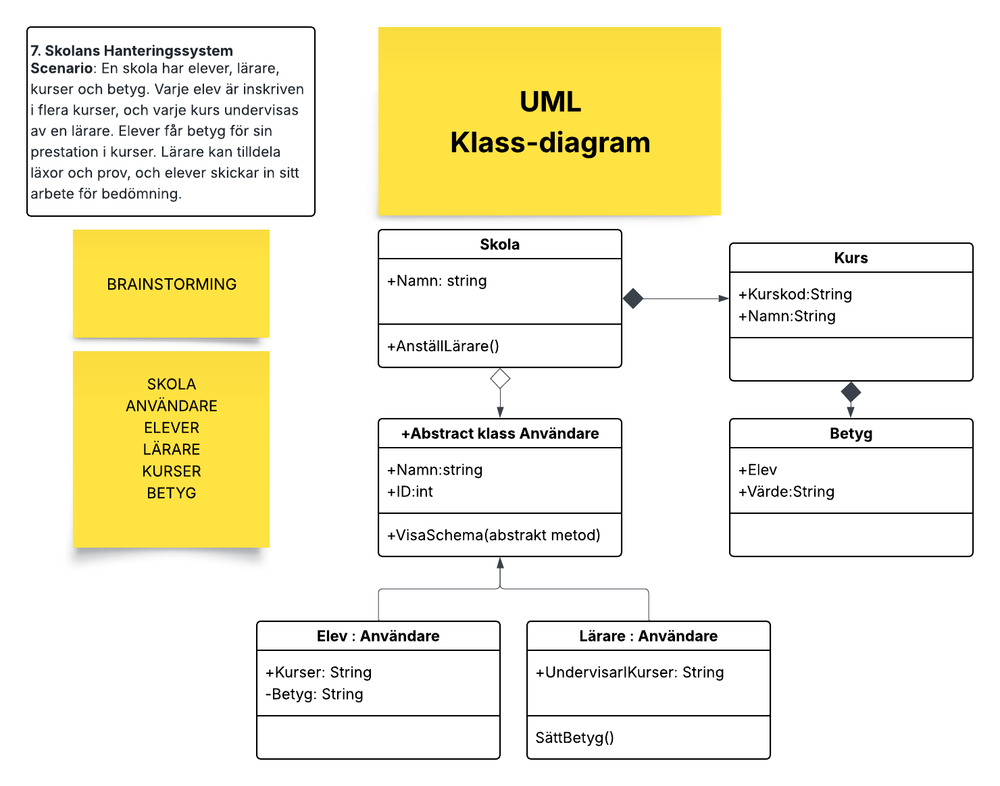

# UMLClassDiagram
Inlämningsuppgift Vecka 4

🎯 Uppgift:

Du ska välja ett av scenarierna nedan och utifrån det skapa ett UML Klassdiagram som representerar ett förenklat system. Diagrammet ska sedan (för VG) översättas till kod i en Console Application.

7. Skolans Hanteringssystem
Scenario: En skola har elever, lärare, kurser och betyg. Varje elev är inskriven i flera kurser, och varje kurs undervisas av en lärare. Elever får betyg för sin prestation i kurser. Lärare kan tilldela läxor och prov, och elever skickar in sitt arbete för bedömning.
